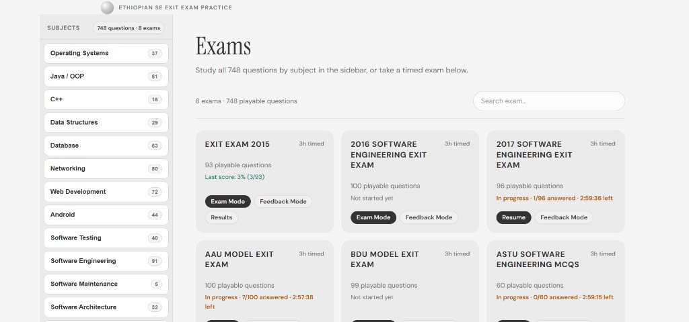
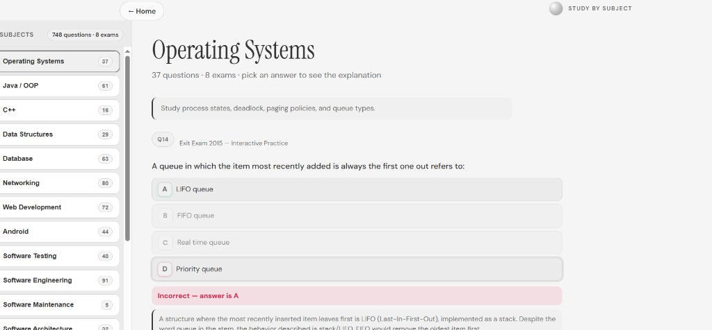
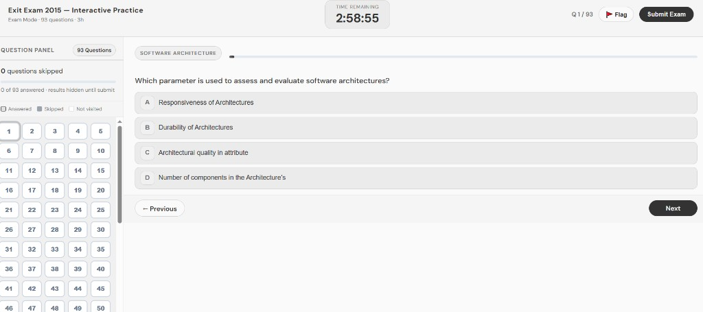

# Ethiopian Software Engineering Exit Exam — Practice App

A web-based MCQ simulator for Ethiopian university **Software Engineering exit exam** preparation. Practice under real exam conditions with a **3-hour timer**, then review every question with **deep explanations for all four choices** (why the correct answer fits and why each distractor fails).

Built for students preparing for the national MoE exit exam and related model papers (2015–2017, AAU, BDU, ASTU, MoEE).

---

## Screenshots

### Home — study by subject or take a timed exam

Browse **748 questions** grouped into **17 subjects** in the sidebar, or start/resume a full 3-hour exam from the main grid.



### Study by subject — scrollable practice with explanations

Pick a subject (e.g. Operating Systems), scroll through all related questions across every exam, choose an answer, and get instant feedback plus a deep explanation — same style as Feedback Mode.



### Exam mode — timed simulation

Practice under real exam conditions: 3-hour timer, question panel, flagging, and answers hidden until you submit.



---

## Features

- **Study by subject** — 748 questions across 8 exams, grouped into 17 topics; scrollable practice with pick-then-explain flow
- **Exam mode** — timed 3-hour sessions, answers hidden until submit (like the real test)
- **Feedback mode** — step through one exam at a time with instant feedback and detailed breakdowns
- **Deep explanations** — overview, per-option analysis (A–D), and study tips for every question
- **Score summary** — percentage score, **score by topic**, and **focus areas** for weak concepts
- **Resume exam** — continue an in-progress attempt (saved in your browser)
- **Mobile-friendly** — responsive layout for phone and desktop

---

## Exams included

| Exam | Questions | Deep explanations |
|------|-----------|-------------------|
| Exit Exam 2015 | 93 | Yes |
| 2016 Software Engineering Exit Exam | 100 | Yes |
| 2017 Software Engineering Exit Exam | 96 | Yes |
| AAU Model Exit Exam | 100 | Yes |
| BDU Model Exit Exam | 99 | Yes |
| ASTU Software Engineering MCQs | 60 | Yes |
| MoEE Model Exam 1 | 100 | Yes |
| 2025 MoEE Exit Exam | 100 | Yes |

Topics covered across exams include: programming fundamentals, data structures, OOP/Java, C++, web development, Android, databases, operating systems, software engineering, software architecture, project management, software testing, networking, security, AI/ML, and general SE concepts.

> **Note:** The 2017 exam has 96 of 100 questions. Four items (Q11, Q22, Q23, Q81) are missing from the source screenshots and could not be recovered from OCR.

---

## Quick start (local)

**Requirements:** Python 3.10+ (stdlib only — no pip packages required to run the server)

```bash
cd practice-app
python server/server.py
```

Open **http://localhost:8081** in your browser.

Default port is `8081`. Override with:

**Windows (PowerShell):**
```powershell
$env:PORT=3000
python server/server.py
```

**Linux / macOS:**
```bash
PORT=3000 python server/server.py
```

---

## How to use

1. **Home** — click a **subject** in the sidebar to practice by topic, or pick an **exam** for timed mode
2. **Study by subject** — scroll through all questions in that topic; pick an answer to reveal the explanation
3. **Start Exam (3h)** — timed attempt; flag questions and navigate freely before submitting
4. **Feedback Mode** — learn one exam at a time; explanations load after you pick an answer
5. **View Results** — see your last score, topic breakdown, and questions you missed

Progress and results are stored in **localStorage** in your browser (no account required). Explanations come from **offline deep explanation** files bundled with each exam.

After updating exam data locally, do a **hard refresh** (Ctrl+Shift+R) so the browser loads new JSON.
